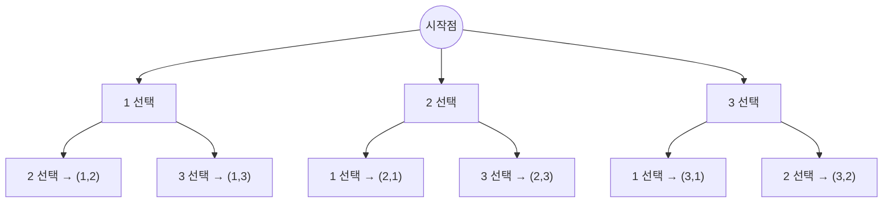

# 필수 알고리즘 - 백트래킹(Backtracking)

## 백트래킹이란?

간단정리: 모든 경우의 수를 탐색하되, **조건에 맞지 않으면 되돌아가서** 다른 경로를 시도하는 방법.

백트래킹은 "되돌아가기"라는 뜻으로, 미로 찾기 게임에서 막다른 길에 다다랐을 때 다시 돌아가서 새로운 길을 찾는 것과 비슷합니다.

## 간단 구현 접근방법

### 백트래킹 함수 밖에 필요한 변수 (전역)
- 1. 전체 크기(n, m) - 문제에서 주어지는 값
- 2. 방문 여부 배열(visited) - 중복 선택 방지
- 3. 결과 배열(result) - 현재까지 선택한 값들

### 백트래킹 함수 안에 필요한 변수
- 1. 현재 깊이(depth) - 몇 번째 선택인지
- 2. for문 - 선택 가능한 모든 경우 순회

### 필요한 메서드
- 백트래킹 재귀 함수
  - 종료 조건 체크
  - 선택 가능한 경우들을 for문으로 순회
  - 선택 → 재귀 호출 → 선택 취소(백트래킹)

### 로직 정리
1. 재귀 함수 진입
2. 종료 조건 체크 (depth == 목표값)
3. for문으로 선택 가능한 모든 경우 순회
    - 선택: visited[i] = true, result.append(i)
    - 재귀: 다음 depth로 이동
    - 취소(백트래킹): visited[i] = false, result.removeLast()

<br><br>

## 백트래킹 구동 원리

**핵심 개념:**
- **재귀 + 선택/취소** 패턴
- **깊게 들어갔다가 되돌아오면서** 모든 경우 탐색
- **조건을 만족하지 않으면 즉시 포기**하고 되돌아감 (가지치기)

**DFS vs 백트래킹:**
- **DFS**: 모든 경로를 끝까지 탐색
- **백트래킹**: 조건에 맞지 않으면 중간에 포기하고 되돌아감 (더 효율적)

**동작 방식:**
1. **선택**: 현재 단계에서 하나를 선택하고 visited 체크
2. **재귀**: 다음 단계로 이동 (깊게)
3. **종료 조건**: 목표 달성 시 결과 저장
4. **취소(백트래킹)**: 선택을 취소(visited 해제)하고 이전 단계로 되돌아감
5. **반복**: for문으로 다른 선택지 시도

**탐색 순서 (3개 중 2개 뽑기 예시):**
```
시작 → 1 선택 → 2 선택 (1,2 완성) ✓
     → 2 취소 ← 되돌아옴
     → 3 선택 (1,3 완성) ✓
     → 3 취소 ← 되돌아옴
     → 1 취소 ← 되돌아옴
     → 2 선택 → 1 선택 (2,1 완성) ✓
     ...
```

**트리로 이해하기:**



- **깊이 1**: for문으로 1, 2, 3 시도
- **깊이 2**: 재귀 호출로 다시 for문 → 깊이 증가
- 각 선택 후 재귀, 그리고 되돌아와서 선택 취소

**재귀함수로 깊이를 동적으로 생성:**
- 깊이 1: 재귀 1번째 호출 → for문 실행
- 깊이 2: 재귀 2번째 호출 → for문 실행
- 깊이 n: 재귀 n번째 호출 → for문 실행
- → 깊이가 가변적이어도 재귀로 해결!

<br><br>


## 백트래킹이 유용한 경우

1. **모든 경우의 수를 탐색**해야 하는 문제
   - 순열, 조합, 부분집합 등
2. **깊이가 가변적**인 경우
   - for문의 중첩 깊이를 미리 알 수 없을 때
3. **조건을 만족하는 해를 찾는** 문제
   - N-Queen, 스도쿠 등
4. **가지치기가 가능**한 문제
   - 조건에 맞지 않으면 즉시 포기하여 효율성 향상

### For Loop로 불가능한 이유

```swift
// n=3, m=2로 고정되어 있으면 가능
for i in 1...3 {
    for j in 1...3 {
        if i != j {
            print(i, j)  // (1,2), (1,3), (2,1), ...
        }
    }
}
```

하지만 **깊이(m)가 가변적이면** for문을 몇 개 중첩할지 알 수 없음!
- m=2 → for문 2개
- m=3 → for문 3개
- m=4 → for문 4개
- ...

→ **재귀로 for문을 동적으로 생성** = 백트래킹

## 시간복잡도

- **중복 가능한 경우**: O(N^M)
  - N이 8까지 가능
- **중복 불가능한 경우**: O(N!)
  - N이 10까지 가능

**중요**: 백트래킹 문제는 보통 **N ≤ 10** 정도로 제한됨 → 문제에서 힌트!

## 자료구조

- **방문 여부 배열**: `var visited = Array(repeating: false, count: n+1)`
- **선택값 배열**: `var result = [Int]()`

## 백트래킹 문제 풀이 예시

예시) [백준 15649 N과 M(1)](https://www.acmicpc.net/problem/15649)

**참고:** 이 문제는 **순열** 문제로, 백트래킹의 가장 기본적인 패턴입니다.

- 문제
자연수 N과 M이 주어졌을 때, 아래 조건을 만족하는 길이가 M인 수열을 모두 구하는 프로그램을 작성하시오.
  - 1부터 N까지 자연수 중에서 중복 없이 M개를 고른 수열

- 입력
첫째 줄에 자연수 N과 M이 주어진다. (1 ≤ M ≤ N ≤ 8)

- 예제 입력 1:
```
3 1
```

- 출력
한 줄에 하나씩 문제의 조건을 만족하는 수열을 출력한다. 중복되는 수열을 여러 번 출력하면 안되며, 각 수열은 공백으로 구분해서 출력해야 한다.
수열은 사전 순으로 증가하는 순서로 출력해야 한다.

- 예제 출력 1:
```
1
2
3
```

- 예제 입력 2:
```
4 2
```

- 예제 출력 2:
```
1 2
1 3
1 4
2 1
2 3
2 4
3 1
3 2
3 4
4 1
4 2
4 3
```

- 예제 입력 3:
```
4 4
```

- 예제 출력 3:
```
1 2 3 4
1 2 4 3
1 3 2 4
1 3 4 2
1 4 2 3
1 4 3 2
2 1 3 4
2 1 4 3
2 3 1 4
2 3 4 1
2 4 1 3
2 4 3 1
3 1 2 4
3 1 4 2
3 2 1 4
3 2 4 1
3 4 1 2
3 4 2 1
4 1 2 3
4 1 3 2
4 2 1 3
4 2 3 1
4 3 1 2
4 3 2 1
```


### 입력부분

```swift
let input = readLine()!.split(separator: " ").map { Int($0)! }
let (n, m) = (input[0], input[1])

// 편의상 사용하기 위한 입력값
// let (n, m) = (3, 2)
```

### 전역 변수 선언

```swift
var visited = Array(repeating: false, count: n+1)  // 방문 여부
var result = [Int]()  // 현재까지 선택한 수열
```

### 백트래킹 함수 구현

```swift
func backtracking(depth: Int) {
    // 1. 종료 조건: m개를 모두 선택했을 때
    if depth == m {
        print(result.map { String($0) }.joined(separator: " "))
        return
    }

    // 2. 1부터 n까지 모든 선택지 시도
    for i in 1...n {
        if !visited[i] {
            // 3. 선택
            visited[i] = true
            result.append(i)

            // 4. 재귀 (다음 depth로)
            backtracking(depth: depth + 1)

            // 5. 취소 (백트래킹)
            visited[i] = false
            result.removeLast()
        }
    }
}

// 실행
backtracking(depth: 0)
```

### 동작 과정 상세 설명

**3개 중 2개 뽑기 (3 2) 예시:**

```
1. depth=0, for i=1
   ├─ 1 선택 → visited[1]=true, result=[1]
   │
   ├─ depth=1, for i=1 (visited[1]=true이므로 skip)
   │
   ├─ depth=1, for i=2
   │  ├─ 2 선택 → visited[2]=true, result=[1,2]
   │  ├─ depth=2 → 출력 "1 2" ✓
   │  └─ 2 취소 ← visited[2]=false, result=[1]
   │
   ├─ depth=1, for i=3
   │  ├─ 3 선택 → visited[3]=true, result=[1,3]
   │  ├─ depth=2 → 출력 "1 3" ✓
   │  └─ 3 취소 ← visited[3]=false, result=[1]
   │
   └─ 1 취소 ← visited[1]=false, result=[]

2. depth=0, for i=2
   └─ 2 선택 → ... (동일한 패턴으로 "2 1", "2 3" 생성)

3. depth=0, for i=3
   └─ 3 선택 → ... (동일한 패턴으로 "3 1", "3 2" 생성)
```

**핵심 포인트:**
- **선택 → 재귀 → 취소** 패턴이 백트래킹의 핵심
- visited 배열로 중복 선택 방지
- depth로 재귀 깊이 관리
- 취소(백트래킹)를 통해 다른 경우의 수 탐색

### 왜 선택을 취소해야 할까?

"1 2"를 만든 후 2를 취소(visited[2]=false)해야, 나중에 "2 1"을 만들 때 2를 다시 사용할 수 있습니다.

**예시:**
- "1 2" 완성 후 2 취소 안하면 → visited[2]=true 유지
- "2 1" 만들 때 2를 선택할 수 없음 (visited[2]=true)
- → 취소를 해야 다른 조합에서 재사용 가능!

이렇게 **선택 표시를 지우고 다시 시도하는 것**이 바로 **백트래킹**입니다!

마치 크레용으로 그림을 그리다가 지우개로 지우고 다시 다른 색을 칠하는 것과 비슷합니다.

## 백트래킹 패턴 정리

```swift
func backtracking(depth: Int) {
    // 1. 종료 조건
    if depth == 목표 {
        // 결과 처리 (출력 또는 저장)
        return
    }

    // 2. 모든 선택지 시도
    for i in 선택_범위 {
        if 선택_가능(i) {
            // 3. 선택
            선택_처리(i)

            // 4. 재귀
            backtracking(depth + 1)

            // 5. 취소 (백트래킹)
            선택_취소(i)
        }
    }
}
```

**이 패턴을 기억하면 대부분의 백트래킹 문제를 풀 수 있습니다!**

### 핵심 요약

1. **재귀 + for문**으로 가변 깊이 구현
2. **선택 → 재귀 → 취소** 패턴
3. **visited 배열**로 중복 방지
4. **종료 조건** 명확히
5. **N ≤ 10** 제한 확인


