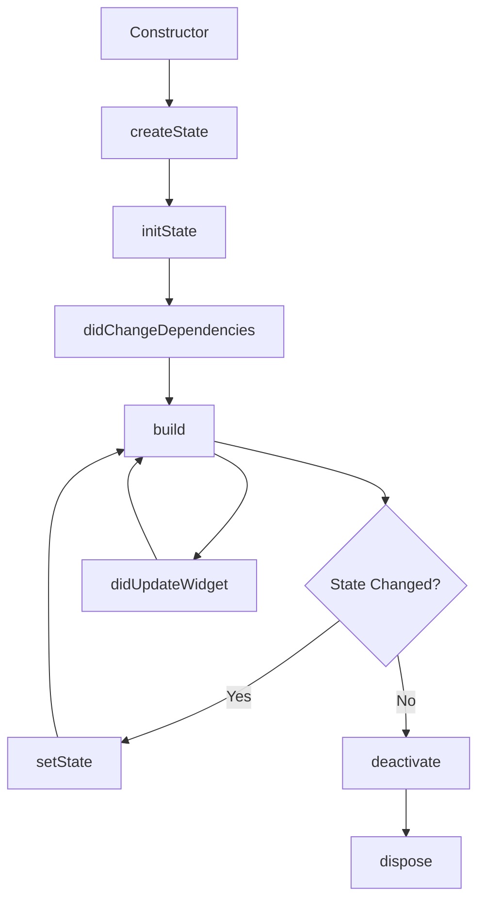

# Flutter 상태관리 기본 구조 이해 - Stateless와 Stateful


## 1. 개요


Flutter 앱 개발에서 UI 위젯은 상태를 가지지 않는 StatelessWidget과 상태를 관리할 수 있는 StatefulWidget으로 구분된다. 이 문서에서는 두 위젯의 차이점과 사용 시나리오를 설명하고, 간단한 예제 코드를 통해 개념을 이해한다.

<br><br>

## 2. 시작하기 전에 알아두면 좋은 것들

- 상태(State)는 UI에 영향을 주는 데이터이며, 상태 관리가 필수적이다.
- 위젯 트리는 불변(immutable)이며, 상태 변경 시에는 위젯을 다시 빌드한다.


<br><br>

## 3. 개념 정리 / 기본 구조

### 3-1. StatelessWidget

`StatelessWidget`은 내부 상태가 없으며, 생성 시 전달된 데이터만으로 UI를 구성한다. 데이터가 변경되면 새로운 위젯 인스턴스를 생성해야 한다.


### 3-2. StatefulWidget


`StatefulWidget`은 상태를 가질 수 있으며, 별도의 `State` 클래스를 통해 상태를 관리한다. `setState()`를 호출하면 프레임워크가 `build()`를 다시 실행한다.


<br><br>

### 3-3. 상태(State)란 무엇인가

상태는 위젯의 UI에 영향을 주는 속성 값이다. 사용자의 상호작용이나 비동기 이벤트 등에 따라 상태가 변경되면, 위젯을 다시 빌드하여 화면을 갱신할 수 있다.


<br><br>

## 4. 예제 코드로 이해하기


### 4-1. 예제 1. StatelessWidget


```dart
class HelloText extends StatelessWidget {
  final String name;

  const HelloText({super.key, required this.name});

  @override
  Widget build(BuildContext context) {
    return Text('Hello, $name!');
  }
}
```


<br><br>

### 4-2. 예제 2. StatefulWidget


```dart
class MyCounter extends StatefulWidget {
  const MyCounter({super.key});

  @override
  // StatefulWidget이 사용할 상태 클래스를 생성하여 반환합니다.
  State<MyCounter> createState() => _MyCounterState();
}

class _MyCounterState extends State<MyCounter> {
  int _count = 0;

  void _increment() {
    setState(() {
      _count++;
    });
  }

  @override
  void initState() {
    super.initState();
    // 초기화 로직 실행
  }

  @override
  Widget build(BuildContext context) {
    return Column(
      mainAxisAlignment: MainAxisAlignment.center,
      children: [
        Text('카운트: $_count'),
        ElevatedButton(
          onPressed: _increment,
          child: const Text('증가'),
        ),
      ],
    );
  }
}
```


<br><br>

## 5. 실무 적용 포인트


- `StatelessWidget`은 상태가 없고 재사용 가능한 위젯에 적합하다.
- `StatefulWidget`은 사용자 입력이나 네트워크 응답 등 동적 UI에 사용한다.
- `setState()`는 최소한의 범위에서 호출하여 불필요한 빌드를 방지한다.
- 상태가 복잡해지면 상태 관리 라이브러리(Provider, Bloc 등) 도입을 고려한다.
- `initState()`에서 네트워크 요청이나 컨트롤러 초기화 작업을 수행할 수 있다.


## 6. 확장 개념 / 보충 설명


- 위젯 생명주기(lifecycle): `initState()`, `didUpdateWidget()`, `dispose()` 등의 메서드를 이해하면 리소스 관리가 용이하다.
- `StatefulWidget` 내부의 상태는 private하게 선언하여 외부에서 직접 변경하지 않는다.
- 복잡한 상태는 `ChangeNotifier`, `ValueNotifier` 등을 사용해 위젯 트리에 전달할 수 있다.


### 🔄 StatefulWidget 생명주기 요약 그래프




## 7. 요약 정리


- `StatelessWidget`은 불변 데이터 기반 UI 구성 요소이다.
- `StatefulWidget`은 내부 상태를 관리하며 `setState()`를 통해 UI를 갱신한다.
- 상태 관리는 앱의 핵심이며, 적절한 위젯 선택과 빌드 최적화가 중요하다.


## 8. 실습 과제


- 버튼을 눌러 테마 색상을 변경하는 `StatefulWidget`을 작성해보세요.
- 간단한 투두 리스트 앱을 구현하여 아이템 추가·삭제 시 상태 관리 로직을 적용해보세요.


## 9. HISTORY


- 250729 : 최초 작성
